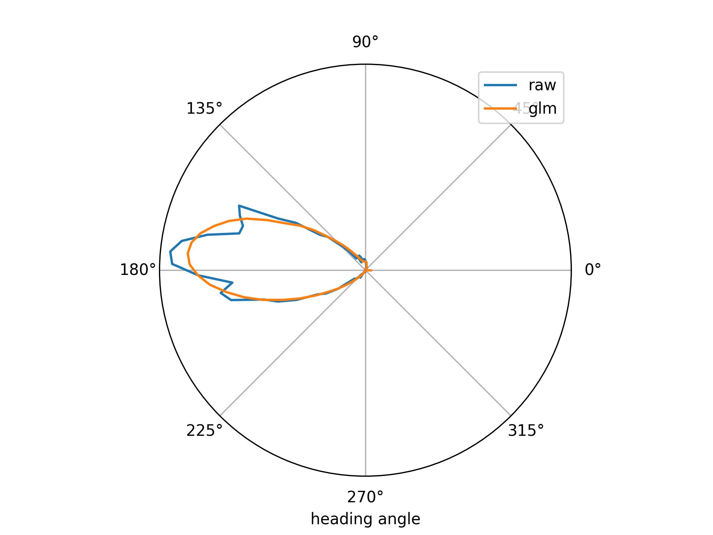

This tutorial will introduce the main `nemos` functionalities. This is intended for users that are 
already familiar with the GLM framework but want to learn how to interact with the `nemos` API. 
If you have used [scikit-learn](https://scikit-learn.org/stable/) before, we are compatible with the [estimator API](https://scikit-learn.org/stable/modules/generated/sklearn.base.BaseEstimator.html), so the quickstart should look 
familiar.

In the following sessions, you will learn:

1. [How to define and fit a GLM model.](#basic-model-fitting)
2. [What are the GLM input arguments.](#model-arguments)
3. [How to use `nemos` with `pynapple` for pre-processing.](#pre-processing-with-pynapple)
4. [How to use `nemos` with `scikit-learn` for pipelines and cross-validation.](#compatibility-with-scikit-learn)

Each of these sections can be run independently of the others.

### Basic Model Fitting

Defining and fitting a `nemos` GLM model is straightforward:

```python
import nemos as nmo
import numpy as np

# predictors, shape (n_samples, n_neurons, n_features)
X = 0.2 * np.random.normal(size=(100, 1, 1))
# true coefficients, shape (n_neurons, n_features)
coef = np.random.normal(size=(1, 1))
# observed counts, shape (n_samples, n_neurons)
y = np.random.poisson(np.exp(np.einsum("nf, tnf -> tn", coef, X)))

# model definition
model = nmo.glm.GLM()
# model fitting
model.fit(X, y)
```


Once fit, you can retrieve model parameters as follows,

```python
# model coefficients, shape (n_neurons, n_features)
print(f"Model coefficients: {model.coef_}")

# model coefficients, shape (n_neurons, )
print(f"Model intercept: {model.intercept_}")
```

!!! note
    This API is the same as scikit-learn's, see for example their [linear regression](https://scikit-learn.org/stable/modules/generated/sklearn.linear_model.LinearRegression.html).

### Model Arguments

During initialization, the `GLM` class accepts the following optional input arguments,

1. `model.observation_model`: The statistical model for the observed variable. The only available option so far is `nemos.observation_models.PoissonObservation`, which is the most common choice for modeling spike counts.
2. `model.regularizer`: Determines the regularization type, defaulting to `nemos.regularizer.Unregularized`.

For more information on how to change default arguments, see the API guide for [`observation_models`]() and
[`regularizer`]().


### Pre-processing with `pynapple`

!!! warning
    This section assumes some familiarity with the `pynapple` package for time-series manipulation and data 
    exploration. If you'd like to learn more about it, take a look at the [`pynapple` documentation](https://pynapple-org.github.io/pynapple/).

`pynapple` is an extremely helpful tool when working with time series data. You can easily perform operations such 
as restricting your time-series to specific epochs (sleep/wake, context A vs. context B, etc.), as well as common 
pre-processing steps in a robust and efficient manner. This includes bin-averaging, counting, convolving, smoothing and many
others. All these operations can be easily concatenated for a quick and easy data pre-processing.

In `nemos`, if a transformation  preserve the time-axis and you use a `pynapple` time-series as input, the result will 
also be a `pynapple` time-series.

A canonical example of this behavior is the `predict` method of `GLM`. 

```python
>>> print(type(X)) # ...Assume X is a pynapple TsdTensor of shape (num samples, num neurons, num features)
nap.TsdTensor

>>> model.fit(X, y) # the following works

>>> firing_rate = model.predict(X) # predict the firing rate of the neuron

>>> print(type(firing_rate)) # this will still be a pynapple time-series of shape (num_samples, num_neurons)
nap.TsdFrame
```

Let's see how you can greatly streamline your analysis pipeline by integrating `pynapple` and `nemos`.

!!! note
    You can download this dataset by clicking [here](https://www.dropbox.com/s/su4oaje57g3kit9/A2929-200711.zip?dl=1).

```python
import nemos as nmo
import numpy as np
import pynapple as nap

data = nap.load_file("A2929-200711.nwb")

spikes = data["units"]
head_dir = data["ry"]

counts = spikes[6].count(0.01, ep=head_dir.time_support)  # restrict and bin
upsampled_head_dir = head_dir.bin_average(0.01) #  up-sample head direction

# create your features
X = nmo.basis.CyclicBSplineBasis(10).evaluate(upsampled_head_dir / (2 * np.pi))

# add a neuron axis and fit model
model = nmo.glm.GLM().fit(X[:, np.newaxis], counts[:, np.newaxis]) 
```

Finally, let's compare the tuning curves

```python
import matplotlib.pyplot as plt

raw_tuning = nap.compute_1d_tuning_curves(spikes, head_dir, nb_bins=100)[6]
model_tuning =  nap.compute_1d_tuning_curves_continuous(
    model.predict(X[:, np.newaxis]) * X.rate,  # scale by the sampling rate
    head_dir, 
    nb_bins=100
)[0]

# plot results
plt.subplot(111, projection="polar")
plt.plot(raw_tuning.index, raw_tuning.values,label="raw")
plt.plot(model_tuning.index, model_tuning.values, label="glm")
plt.legend()
plt.yticks([])
plt.xlabel("heading angle")
```



### Compatibility with `scikit-learn`

`scikit-learn` is a machine learning toolkit that offers advanced features like pipelines and cross-validation methods. 

In `nemos` takes advantage of these features, while still gaining the benefit of JAX's just-in-time 
compilation and GPU-acceleration!

For example, if we would like to tune the critical hyper-parameter `regularizer_strength`, we
could easily run a `K-Fold` cross-validation using `scikit-learn`.

```python
import nemos as nmo
from sklearn.model_selection import GridSearchCV

# ...Assume X and y are available or generated as shown above

# model definition
model = nmo.glm.GLM(regularizer=nmo.regularizer.Ridge())

# fit a 5-fold cross-validation scheme for comparing two different
# regularizer strengths:

# - define the parameter grid
param_grid = dict(regularizer__regularizer_strength=(0.01, 0.001))

# - define the 5-fold cross-validation grid search from sklearn
cls = GridSearchCV(model, param_grid=param_grid, cv=5)

# - run the 5-fold cross-validation grid search
cls.fit(X, y)

# print best regularizer strength
print(cls.best_params_)
```
